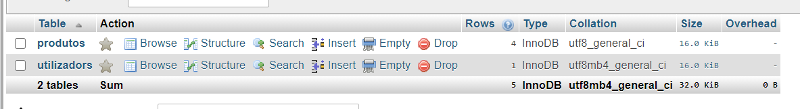
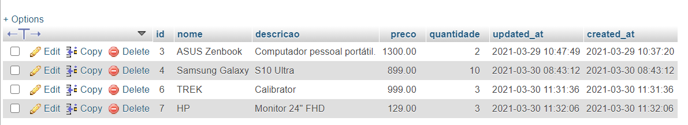
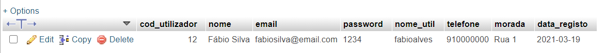

## Laravel Beginner Project

Laravel is a web application framework with expressive, elegant syntax. Laravel is accessible, powerful, and provides tools required for large, robust applications.

This PHP project is a simple project with some useful and simple functionalities, such as:
- Items Managemet
- Items paginate
- Users Management
- Login and Logout

PHP MyAdmin was used as DATABASE. To configure your database you need to change the DB settings on the *.env* file. For this project the DB has two tables, *produtos* and *utilizadors* as you can see on the following images. 

**Database**

**Products Table**

**Users Table**

>The project has comments lines in Portuguese and some variables are written in Portuguese as well.

